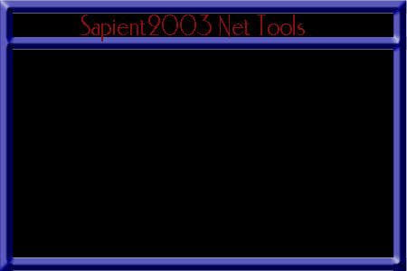



## Sapient2003 Net Tools 2\.3

### Description

This program is a collection of usefull internet

tools which contains raw connections, HTML stealer

, port listener, port scanner, anonymous email,

proccess viewer, finger, ping, speed check, Whois,

and host lookup. This program is based off the

other internet tool program on this site, except

I fixed a lot of bugs including his winsock buffer

problem. I also added a few things such as a ICQ

crasher (for fun!) If you like how I did this

program, please vote for me.
 
### More Info
 
You don't need to know to much, just the basics

like TCP, UDP, servers, ect...

For the raw connection, most of the time you may

need to click the Connect button twice before it

will work. I am not sure if the speed check works.

The last problem is that the html stealer is a

little slow.

             |
---                |---
**Submitted On**   |2000-12-23 19:40:12
**By**             |[Sapient2003](https://github.com/Planet-Source-Code/PSCIndex/blob/master/ByAuthor/sapient2003.md)
**Level**          |Intermediate
**User Rating**    |4.8 (19 globes from 4 users)
**Compatibility**  |VB 5\.0, VB 6\.0
**Category**       |[Internet/ HTML](https://github.com/Planet-Source-Code/PSCIndex/blob/master/ByCategory/internet-html__1-34.md)
**World**          |[Visual Basic](https://github.com/Planet-Source-Code/PSCIndex/blob/master/ByWorld/visual-basic.md)
**Archive File**   |[CODE\_UPLOAD1299812232000\.zip](https://github.com/Planet-Source-Code/sapient2003-sapient2003-net-tools-2-3__1-13826/archive/master.zip)

